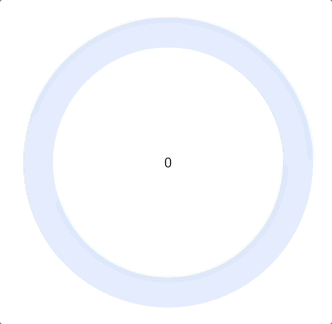
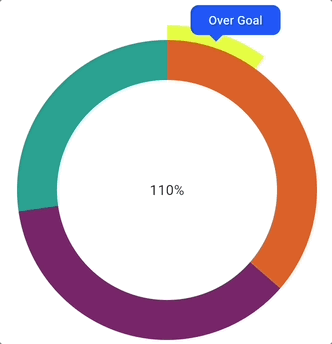
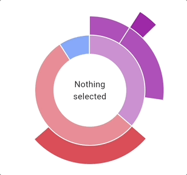
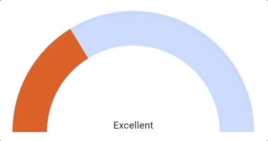
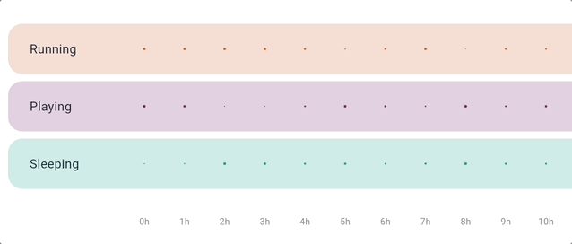
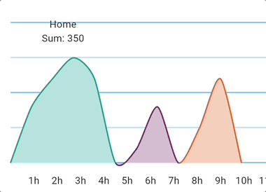
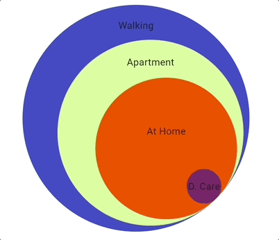

## Overview
CB Charts Flutter is a Flutter chart library that supports **Ring chart, Sunburst chart, Gauge chart, Bubble chart, Sectioned line chart, and Stacked circle chart**.

## Types

### Ring chart
Set this chart with or without a goal, and it will adapt its behavior.  

### Sunburst chart
Configure child layers to each layer. Ideal to show dependent information.  

### Gauge chart
A simple chart to show a percentage from an information (achievement, level etc).

### Bubble chart
It shows bubbles whose diameter depends on the ratio of that lane to the x-axis. The scale of how the bubbles are inflated is customizable. Use this to compare the duration of different activities over time, for example.  

### Sectioned line chart
A line chart with user customizable sections. Use this when you need extra information (like location) in a line graph.  

### Stacked circle chart
A simple chart to stack circles based on proportions. The user can choose the alignment.  

## Getting started

1. Add the `cb_charts_flutter` dependency in your project: `flutter pub add cb_charts_flutter`
2. Import it in your dart code: `import 'package:cb_charts_flutter/cb_charts_flutter.dart';`
3. Now you can check our samples (in `/example` folder).
